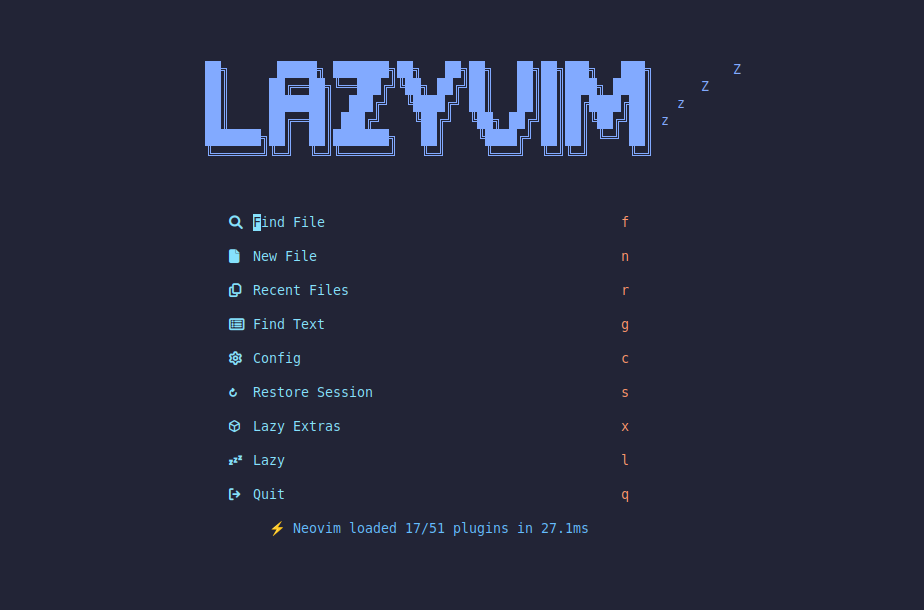
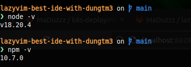

# Lazyvim - The best IDE with dungtm3

## Author: Tran Manh Dung

### Install lazyvim

- According to Docusaurus's public site write everything about lazyvim (installation guide, keymaps, plugins, extras,...), I wanna share to everybody the documentation and configuration files to make lazyvim to your ide (especially for Python developers).
- Step by step to install lazyvim
  - I hightly recommended you use **starship** Ubuntu package. Because it's a simply way to make your terminal looks better than default. To complete the task, you only need to run command:

  `$ sudo snap install --edge starship`
  
  Then add line **eval "$(starship init bash)"** at the end of  `~/.bashrc` file.
  - If you had use neovim back in the day, you should make a backup of your current Neovim files

  ```
  (required)
  $ mv ~/.config/nvim{,.bak}
  (optional but recommended)
  $ mv ~/.local/share/nvim{,.bak}
  $ mv ~/.local/state/nvim{,.bak}
  $ mv ~/.cache/nvim{,.bak}
  ```

  - Clone the starter:

  `$ git clone https://github.com/LazyVim/starter ~/.config/nvim`
  - (Optional) You can remove *.git* folder and you can add your remote repository later
  
  `$ rm -rf ~/.config/nvim/.git`
  - If you not use neovim before, you have to install neovim package first. Remember that lazyvim requires neovim version >= 0.8.0 to start stably. Follow the site <https://github.com/neovim/neovim/blob/master/INSTALL.md> to install neovim or upgrade existed version (if lower than 0.8.0)
  - Lazyvim IDE compatible with NerdFont, so you should install NerdFont Family to increase your experience while use that ide. Follow the link to choose and install NerdFont that you like <https://www.nerdfonts.com/font-downloads>. Remember that you need to change font family in the setting terminal you used to apply NerdFont Family after installed.
  - Now, you can start Neovim: `nvim`
  - Let see the result
  
- REF: <http://www.lazyvim.org/>

### Custom lazyvim

- Firstly, you need to install node (nodejs) package (recommended version 18 or higher). Follow the official site of nodejs to install specific version. Illustrative results:

  

- At the beginning screen of lazyvim, press button `x` to open `Lazy Extras` window. The modal will list any plugins about lang(languages), linter,... Use your arrow buttons navigate the cursor to the plugin you need and press x to put the plugin into Install category. Press `Shift + i`-> (I) to install all plugins you chose.

- If you get the error when lazyvim install `treesitter` plugins. The error detail like git clone the repository from remote failed through proxy,... Let try some below steps
  - Delete the exist treesitter directory and file created by lazyvim to clear cache and workspace. Illustrative commands

  `$ rm -rf /home/cloud/.local/share/nvim/lazy/nvim-treesitter.cloning /home/cloud/.local/share/nvim/lazy/nvim-treesitter`

  - Clone treesitter repo and copy to specific directory manually

  `$ git clone https://github.com/nvim-treesitter/nvim-treesitter.git /home/cloud/.local/share/nvim/lazy/nvim-treesitter`

  - Create new config `treesitter.lua` in lua/plugins directory

  ```treesitter.lua
  return {
  "nvim-treesitter/nvim-treesitter",
   config = function(_, opts)
   require("nvim-treesitter.configs").setup(opts)
   end,
  ```

  - Exit lazyvim then start again
- Install **fd-find** Ubuntu package to let VenvSelector plugin of lazy can find out your python virtual env. Follow the public site <https://github.com/sharkdp/fd?tab=readme-ov-file#installation>

```bash
sudo apt install fd-find
ln -s $(which fdfind) ~/.local/bin/fd
```

- Setup **auto-session** plugin. AutoSession takes advantage of Neovim's existing session management capabilities to provide seamless automatic session management. Add some config lines below into `lazy.lua` file

```lua
...
{
"rmagatti/auto-session",
config = function()
  require("auto-session").setup({
    log_level = "error",
    auto_session_suppress_dirs = { "~/", "~/Downloads" },
  })
end,
},
...
```
